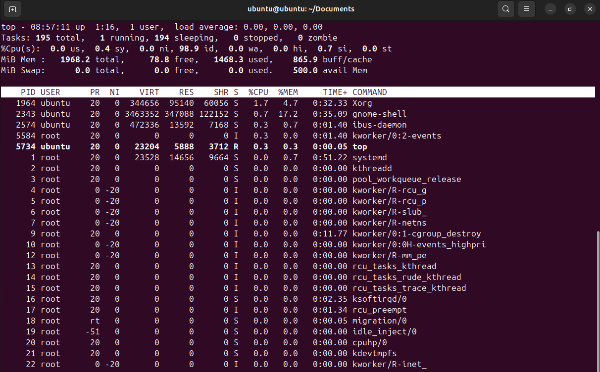

# VI. Tiến trình

\- Lệnh ps cho phép bạn hiển thị thông tin về các tiến trình đang chạy. Nó tạo ra một danh sách tĩnh, tức là một ảnh chụp nhanh về những gì đang chạy khi bạn thực hiện lệnh. Nếu bạn muốn có danh sách các tiến trình đang chạy được cập nhật liên tục, thay vào đó hãy sử dụng lệnh top hoặc ứng dụng System Monitor

## a. ps command

\- To list all processes that are currently running on the system including processes owned by other users, type the following at a shell prompt: `ps ax`
\- To display the owner alongside each process, use the following command: `ps aux`
\- Bạn cũng có thể sử dụng lệnh ps kết hợp với grep để xem liệu một quy trình cụ thể có đang chạy hay không. Ví dụ: để xác định xem Emacs có đang chạy hay không, hãy nhập: `ps ax | grep emacs`

## b. top command

\- Lệnh top cùng hiển thị danh sách các tiến trình đang chạy trên hệ thống theo thời gian thực. Nó cũng hiển thị thông tin bổ sung về thời gian hoạt động của hệ thống, mức sử dụng CPU và bộ nhớ hiện tại hoặc tổng số tiến trình đang chạy và cho phép bạn thực hiện các hành động như sắp xếp danh sách hoặc hủy một tiến trình.
\- Để chạy lệnh top, gõ lệnh sau tại dấu nhắc shell: top
\- Đối với mỗi quy trình được liệt kê, lệnh trên cùng hiển thị ID tiến trình (PID), tên người dùng hiệu quả của chủ sở hữu quy trình (USER), mức độ ưu tiên (PR), giá trị Nice (NI), dung lượng bộ nhớ ảo mà quy trình sử dụng ( VIRT), dung lượng bộ nhớ vật lý không được hoán đổi mà tiến trình sử dụng (RES), dung lượng bộ nhớ dùng chung mà tiến trình sử dụng (SHR), trường trạng thái tiến trình S), tỷ lệ phần trăm của CPU (%CPU) và bộ nhớ (% MEM), thời gian CPU tích lũy (TIME+) và tên của tệp thực thi (COMMAND). Ví dụ:

## c. kill command

\- Lệnh 'kill' trong Linux là một công cụ mạnh mẽ, đặc biệt khi bạn cần quản lý các tiến trình không phản hồi hoặc tiêu tốn quá nhiều tài nguyên hệ thống. Về cơ bản nhất, lệnh 'kill' được sử dụng để chấm dứt các tiến trình.
\- Syntax kill một tiến trình: `kill PID`
\- Khi bạn trở nên quen thuộc hơn với lệnh 'kill' trong Linux, bạn sẽ thấy rằng nó mang lại nhiều lợi ích hơn là chỉ chấm dứt các quy trình. Lệnh 'kill' có thể gửi các loại tín hiệu khác nhau đến các tiến trình, có thể được sử dụng để kiểm soát chúng theo nhiều cách khác nhau.Dưới đây là bảng chứa một số tín hiệu được sử dụng phổ biến nhất:

| Signal              | Description                                                                                     | Example            |
| :------------------ | :---------------------------------------------------------------------------------------------- | :----------------- |
| SIGTERM             | Requests a process to terminate but allows it to perform cleanup operations before terminating. | kill -SIGTERM 1234 |
| SIGKILL             | Forces a process to terminate immediately.                                                      | kill -SIGKILL 1234 |
| SIGSTOP             | Pauses a process.                                                                               | kill -SIGSTOP 1234 |
| SIGCONT             | Resumes a paused process.                                                                       | kill -SIGCONT 1234 |
| SIGHUP              | Sends a signal to a process when the terminal controlling it is closed.                         | kill -SIGHUP 1234  |
| SIGINT              | Sends an interrupt signal, usually initiated by the user.                                       | kill -SIGINT 1234  |
| SIGQUIT             | Sends a quit signal, which often results in a core dump.                                        | kill -SIGQUIT 1234 |
| SIGABRT             | Sends an abort signal, which often results in a core dump.                                      | kill -SIGABRT 1234 |
| SIGALRM             | Used to alarm/countdown.                                                                        | kill -SIGALRM 1234 |
| SIGUSR1 and SIGUSR2 | User-defined signals.                                                                           | kill -SIGUSR1 1234 |

## d. Nice and Renice in linux

\- Lệnh Nice trong Linux giúp thực thi một chương trình/quy trình với mức độ ưu tiên lập lịch đã được sửa đổi. Nó khởi chạy một quy trình với mức độ ưu tiên lập lịch do người dùng xác định. Trong trường hợp này, nếu chúng ta ưu tiên một tiến trình cao hơn thì Kernel sẽ phân bổ nhiều thời gian CPU hơn cho tiến trình đó. Trong khi đó lệnh renice cho phép bạn thay đổi và sửa đổi mức độ ưu tiên lập lịch của một quy trình đang chạy. Hạt nhân Linux lên lịch cho quá trình và phân bổ thời gian CPU phù hợp cho từng quy trình.

1. To check the nice value of a process
   `ps -el | grep terminal`
2. To set the priority of a process
   `nice -10 gnome-terminal`
3. To set the negative priority for a process
   `nice --10 gnome-terminal`
4. changing priority of the running process.
   `sudo renice -n 15 -p 77982`
5. To change the priority of all programs of a specific group.
   `renice -n 10 -g 4`
6. To change the priority of all programs of a specific user.
   `sudo renice -n 10 -u 2`
