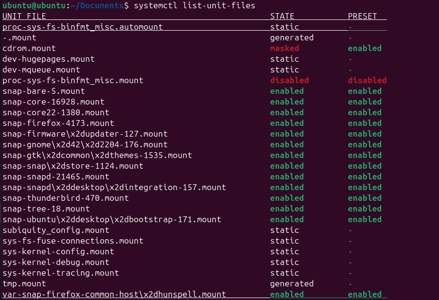
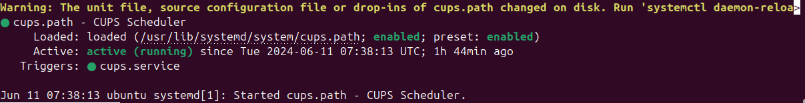
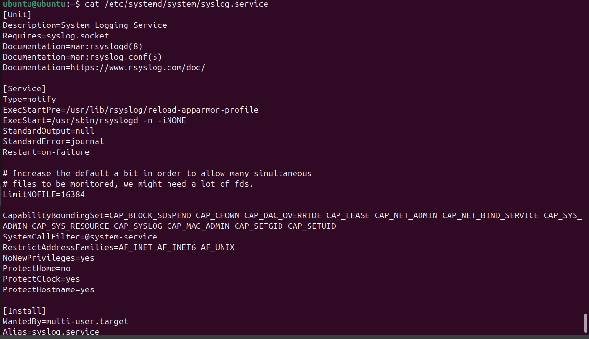

# VII. Systemctl

## a. Systemctl là gì?

\- Systemctl là một tiện ích dòng lệnh, có nhiệm vụ điều khiển hệ thống systemd và service manager. Systemd là một bộ công cụ để quản lý hệ thống Linux, nó được sử dụng để khởi động máy, quản lý dịch vụ, hệ thống file tự động, ghi sự kiện, thiết lập tên máy chủ và các tác vụ hệ thống khác. Systemd sử dụng các khái niệm unit, package, service, socket.
\- Systemctl được sử dụng để kiểm soát systemd và quản lý các dịch vụ. Nó là một phần của hệ sinh thái systemd và có sẵn theo mặc định trên tất cả các hệ thống.
\- Với Systemctl bạn có thể kiểm tra được trạng thái của các service, khởi động và tắt service, gỡ rối hệ thống khi xảy ra sự cố.

## b. Cách quản lý dịch vụ hệ thống trong Linux

Để xem được các dịch vụ đã được enable hay disable thì phải dùng lệnh `systemctl list-unit-files`:

> nhấn 'q' để có thể thoát khỏi giao diện này

* **Khởi động hoặc dừng service**
  \- Khởi động: `systemctl start [service]`
  \- Dừng: `systemctl stop [service]`
* **Kích hoạt và vô hiệu hóa service**
  \- Kích hoạt: `systemctl enable [service]`
  \- Vô hiệu hóa: `systemctl disable [service]`
* **Xem trạng thái service**
  \- Xem trạng thái service: `systemctl status [service]`

> Dòng 1 là mô tả service (đọc từ /lib/systemd/system/ssh.service)
> Dòng 2 mô tả trạng thái load
> loaded - load thành công
> error - có lỗi khi load file
> not-found - file không tìm thấy
> bad-setting - cài đặt quan trọng bị thiếumasked - nếu file unit bị masked

* **Khởi động lại và tải lại service**
  \- Khởi động lại: `systemctl restart [service]`
  \- Tải lại: `systemctl reload [service]`
* **Masking hoặc unmasking service**
  Khi một dịch vụ được mask, nó sẽ bị "giấu đi" và không thể được khởi động hoặc tương tác với bằng systemctl. Đây là một cách an toàn để ngăn chặn hoặc ngăn chặn sự khởi động của một dịch vụ mà bạn không muốn hoạt động trên hệ thống của mình.
  Còn khi unmask một dịch vụ, nó sẽ được phục hồi và có thể được quản lý như bình thường bằng systemctl.
  \- Masking: `systemctl mask [service]`
  \- Unmasking: `systemctl unmask [service]`
* **Thay đổi Default Target**
  Target là một nhóm các dịch vụ được systemd quản lý, và chúng thường được sử dụng để định nghĩa các trạng thái hoạt động của hệ thống, chẳng hạn như multi-user.target cho môi trường đa người dùng hoặc graphical.target cho môi trường đồ họa.
  \- Cú pháp:  `systemctl set-default [target]`
* **Liệt kê Unit Files**
  \- Cú pháp:  `systemctl list-unit-files`
* **Masking hoặc unmasking unit file**
  Ta đã thấy trong phần quản lý dịch vụ cách dừng hoặc vô hiệu hóa một dịch vụ, nhưng systemd cũng có khả năng đánh dấu một đơn vị là hoàn toàn không thể khởi động, tự động hoặc thủ công, bằng cách liên kết nó với /dev/null . Điều này được gọi là tạo mặt nạ cho đơn vị và có thể thực hiện được với lệnh mask :

  \- Masking: `systemctl mask [unit-file]` \- Unmasking: `systemctl unmask [unit-file]`

  

## c. Cấu trúc tệp tin service

  FIle service gồm 3 thành phần chính là `[Unit]`, `[Service]`, `[Install]`
  Ví dụ:
  

**Phần Unit:** Chứa các thông tin về unit bao gồm mô tả, các phụ thuộc,....

| Option        | Description                                                                                                                                                                                                                                                                                                                      |
| :------------ | :------------------------------------------------------------------------------------------------------------------------------------------------------------------------------------------------------------------------------------------------------------------------------------------------------------------------------- |
| Description   | Một mô tả ngắn gọn về unit                                                                                                                                                                                                                                                                                                 |
| Documentation | Danh sách tài liệu tham chiếu URI.                                                                                                                                                                                                                                                                                           |
| Before, After | Thứ tự các đơn vị được bắt đầu.                                                                                                                                                                                                                                                                                      |
| Requires      | Nếu đơn vị này được kích hoạt, các đơn vị được liệt kê ở đây cũng sẽ được kích hoạt. Nếu một trong các thiết bị khác bị vô hiệu hóa hoặc bị lỗi, thiết bị này sẽ bị vô hiệu hóa.                                                                                               |
| Wants         | Định cấu hình các phần phụ thuộc yếu hơn Requires. Nếu bất kỳ thiết bị nào được liệt kê không khởi động thành công, điều đó sẽ không ảnh hưởng đến việc kích hoạt thiết bị. Đây là cách được khuyến nghị để thiết lập các phần phụ thuộc của đơn vị tùy chỉnh. |
| Conflicts     | Nếu một thiết bị có cài đặt Conflicts trên một thiết bị khác, việc khởi động thiết bị trước sẽ dừng thiết bị sau và ngược lại.                                                                                                                                                                      |

Danh sách những tùy chọn phần [Unit]: `man systemd.unit`
**Phần Service:** Xác định các service được chạy, bao gồm đường dẫn,...

| Option          | Description                                                                                                                                                                                                                                                                                                                                                                                                                                                                                                                                                                                                                                                                                                                                                                                                                                                                                                                                                                                                                                                                                                                                                                                                                               |
| :-------------- | :---------------------------------------------------------------------------------------------------------------------------------------------------------------------------------------------------------------------------------------------------------------------------------------------------------------------------------------------------------------------------------------------------------------------------------------------------------------------------------------------------------------------------------------------------------------------------------------------------------------------------------------------------------------------------------------------------------------------------------------------------------------------------------------------------------------------------------------------------------------------------------------------------------------------------------------------------------------------------------------------------------------------------------------------------------------------------------------------------------------------------------------------------------------------------------------------------------------------------------------- |
| Type            | Định cấu hình kiểu khởi động quy trình. Một trong:` ` **simple** (default) - bắt đầu dịch vụ ngay lập tức. Dự kiến quy trình chính của dịch vụ được xác định trong **ExecStart**. ` ` **forking** – coi như dịch vụ đã khởi động sau khi tiến trình rẽ nhánh và tiến trình gốc đã thoát. ` ` **oneshot** – tương tự như simple, nhưng dự kiến quy trình phải thoát trước khi systemd khởi động các đơn vị tiếp theo (hữu ích cho các tập lệnh thực hiện một công việc duy nhất rồi thoát ra). Bạn cũng có thể muốn đặt **RemainAfterExit=yes** để systemd vẫn coi dịch vụ là đang hoạt động sau khi quá trình kết thúc. ` ` **dbus** - tương tự như simple, nhưng coi dịch vụ đã khởi động khi quy trình chính có tên D-Bus. ` ` **notify** - tương tự như simple, nhưng coi dịch vụ chỉ khởi động sau khi nó gửi tín hiệu đặc biệt đến systemd. ` ` **idle** - tương tự như simple, nhưng việc thực thi thực tế nhị phân dịch vụ bị trì hoãn cho đến khi tất cả công việc hoàn thành. |
| ExecStart       | Các lệnh thực thi để dừng dịch vụ bắt đầu thông qua**ExecStart**.                                                                                                                                                                                                                                                                                                                                                                                                                                                                                                                                                                                                                                                                                                                                                                                                                                                                                                                                                                                                                                                                                                                                                       |
| ExecReload      | Các lệnh thực thi để kích hoạt tải lại cấu hình trong dịch vụ.                                                                                                                                                                                                                                                                                                                                                                                                                                                                                                                                                                                                                                                                                                                                                                                                                                                                                                                                                                                                                                                                                                                                                               |
| Restart         | Khi bật tùy chọn này, dịch vụ sẽ được khởi động lại khi quá trình dịch vụ thoát, bị hủy hoặc hết thời gian chờ ngoại trừ lệnh dừng bình thường bằng lệnh**systemctl stop**.                                                                                                                                                                                                                                                                                                                                                                                                                                                                                                                                                                                                                                                                                                                                                                                                                                                                                                                                                                                                                       |
| RemainAfterExit | Nếu được đặt thành**True**, dịch vụ được coi là hoạt động ngay cả khi tất cả các quá trình của dịch vụ đó đã thoát. Hữu ích với **Type=oneshot**. Giá trị mặc định là **False**.                                                                                                                                                                                                                                                                                                                                                                                                                                                                                                                                                                                                                                                                                                                                                                                                                                                                                                                                                                                                 |

Danh sách những tùy chọn phần [Service]: `man systemd.service`
**Phần Install:** Liên quan đến các service sẽ được cài đặt...Danh sách các tùy chọn phần [Install]: `man systemd.install`

| Option               | Description                                                                                                                                                                                                                  |
| :------------------- | :--------------------------------------------------------------------------------------------------------------------------------------------------------------------------------------------------------------------------- |
| Alias                | Danh sách tên bổ sung được phân tách bằng dấu cách cho đơn vị. Hầu hết các lệnh**systemctl**, ngoại trừ **systemctl enalbe**, có thể sử dụng bí danh thay vì tên đơn vị thực tế. |
| RequiredBy, WantedBy | Dịch vụ hiện tại sẽ được bắt đầu khi các dịch vụ được liệt kê được bắt đầu. Xem mô tả về**Wants** và **Requires** trong phần [Unit] để biết chi tiết.                          |
| Also                 | Chỉ định danh sách các đơn vị sẽ được bật hoặc tắt cùng với đơn vị này khi người dùng chạy**systemctl enable** hoặc **systemctl disable**.                                             |

# Tài liệu tham khảo

[Cấu trúc tập tin service](https://www.shellhacks.com/systemd-service-file-example/)
